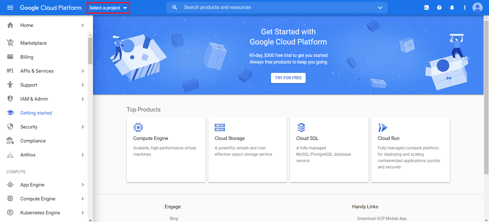
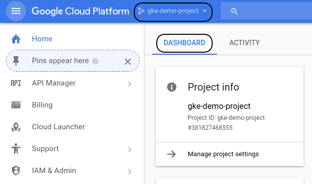
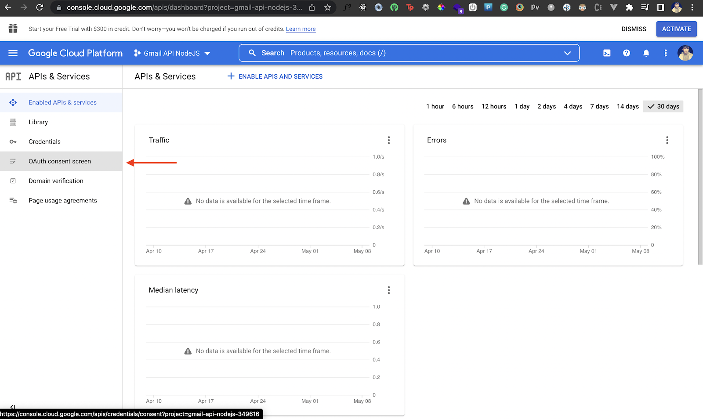
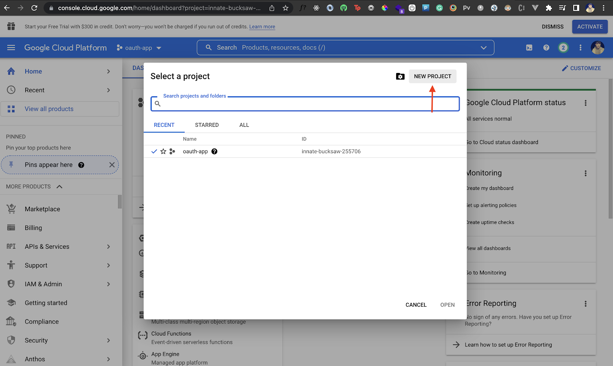
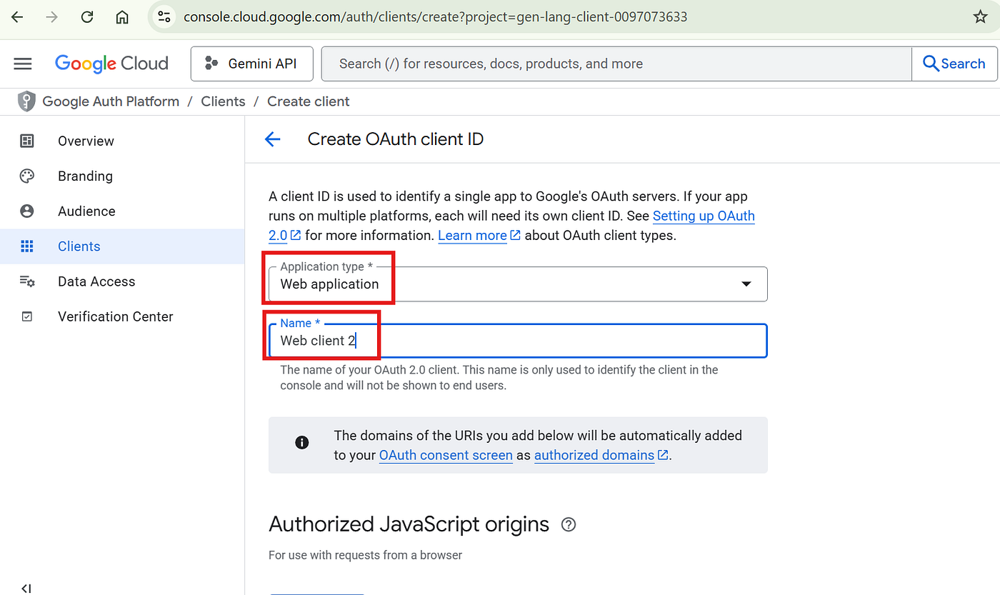
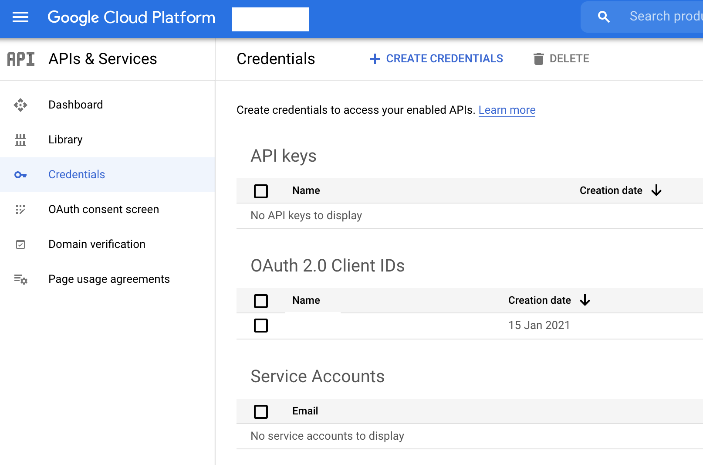

# Guía Visual: Configuración de Gmail API para EPM Construcciones

**Documento preparado para:** EPM Construcciones  
**Plataforma:** Ivy.AI - Sistema de Agentes Inteligentes  
**Tiempo estimado:** 20 minutos  
**Nivel de dificultad:** Intermedio  
**Autor:** Manus AI

---

## Índice

1. [Introducción](#introducción)
2. [Requisitos Previos](#requisitos-previos)
3. [Parte 1: Crear Proyecto en Google Cloud Console](#parte-1-crear-proyecto-en-google-cloud-console)
4. [Parte 2: Habilitar Gmail API](#parte-2-habilitar-gmail-api)
5. [Parte 3: Configurar Credenciales OAuth 2.0](#parte-3-configurar-credenciales-oauth-20)
6. [Parte 4: Obtener Refresh Token](#parte-4-obtener-refresh-token)
7. [Parte 5: Configurar Credenciales en Ivy.AI](#parte-5-configurar-credenciales-en-ivyai)
8. [Solución de Problemas](#solución-de-problemas)
9. [Preguntas Frecuentes](#preguntas-frecuentes)

---

## Introducción

Esta guía le permitirá configurar Gmail API para que la plataforma Ivy.AI pueda enviar emails automatizados desde la cuenta `epmconstrucciones@gmail.com`. El proceso es completamente seguro y le da control total sobre qué permisos otorga a la aplicación.

### ¿Por qué necesito hacer esto?

Gmail API requiere autenticación OAuth 2.0 para proteger su cuenta de email. Esto significa que **solo usted** puede autorizar el acceso a su cuenta de Gmail, generando credenciales únicas que la plataforma Ivy.AI utilizará para enviar emails en su nombre.

### ¿Qué voy a obtener?

Al finalizar esta guía, tendrá tres credenciales que ingresará en Ivy.AI:

1. **Client ID** - Identificador público de la aplicación
2. **Client Secret** - Clave secreta (como una contraseña)
3. **Refresh Token** - Token de acceso permanente a Gmail

---

## Requisitos Previos

Antes de comenzar, asegúrese de tener:

- ✅ Acceso a la cuenta de Gmail `epmconstrucciones@gmail.com`
- ✅ Permisos de administrador en esa cuenta
- ✅ Una cuenta de Google Cloud (se puede crear gratis durante el proceso)
- ✅ Navegador web actualizado (Chrome, Firefox, Edge o Safari)
- ✅ 20 minutos de tiempo ininterrumpido

**Nota importante:** Este proceso **no tiene costo**. Google Cloud ofrece una capa gratuita que es más que suficiente para el envío de emails de EPM.

---

## Parte 1: Crear Proyecto en Google Cloud Console

### Paso 1.1: Acceder a Google Cloud Console

1. Abra su navegador web y vaya a: **https://console.cloud.google.com**
2. Inicie sesión con la cuenta `epmconstrucciones@gmail.com`
3. Si es la primera vez que usa Google Cloud, acepte los términos de servicio



### Paso 1.2: Crear Nuevo Proyecto

1. En la parte superior de la pantalla, haga clic en el **selector de proyectos** (junto al logo de Google Cloud)
2. En la ventana emergente, haga clic en **"Nuevo Proyecto"** (esquina superior derecha)



3. Complete el formulario con la siguiente información:
   - **Nombre del proyecto:** `EPM Email Automation`
   - **Organización:** Dejar en blanco (o seleccionar si tiene una)
   - **Ubicación:** Dejar en blanco

4. Haga clic en **"Crear"**

5. Espere 10-15 segundos mientras Google crea el proyecto

6. Una vez creado, asegúrese de que el proyecto **"EPM Email Automation"** esté seleccionado en el selector de proyectos (parte superior)

**✅ Checkpoint:** Debe ver "EPM Email Automation" en la parte superior de la consola.

---

## Parte 2: Habilitar Gmail API

### Paso 2.1: Acceder a la Biblioteca de APIs

1. En el menú lateral izquierdo, haga clic en **"APIs y servicios"** → **"Biblioteca"**
   - Si no ve el menú lateral, haga clic en el ícono de hamburguesa (☰) en la esquina superior izquierda



### Paso 2.2: Buscar Gmail API

1. En la barra de búsqueda de la biblioteca, escriba: **`Gmail API`**
2. Haga clic en el resultado **"Gmail API"** (debe tener el logo de Gmail)



### Paso 2.3: Habilitar la API

1. En la página de Gmail API, haga clic en el botón azul **"Habilitar"**
2. Espere 5-10 segundos mientras se habilita la API
3. Será redirigido a la página de información de Gmail API

**✅ Checkpoint:** Debe ver un mensaje que dice "Gmail API habilitada" y un botón "Administrar".

---

## Parte 3: Configurar Credenciales OAuth 2.0

### Paso 3.1: Configurar Pantalla de Consentimiento

Antes de crear credenciales, Google requiere que configure la "pantalla de consentimiento" (lo que los usuarios verán al autorizar la app).

1. En el menú lateral, vaya a **"APIs y servicios"** → **"Pantalla de consentimiento de OAuth"**

2. Seleccione **"Externo"** como tipo de usuario y haga clic en **"Crear"**

3. Complete el formulario con la siguiente información:

   **Información de la aplicación:**
   - **Nombre de la aplicación:** `Ivy.AI Email Automation`
   - **Correo electrónico de asistencia del usuario:** `epmconstrucciones@gmail.com`
   - **Logo de la aplicación:** (opcional, puede dejarlo en blanco)

   **Información de contacto del desarrollador:**
   - **Direcciones de correo electrónico:** `epmconstrucciones@gmail.com`

4. Haga clic en **"Guardar y continuar"**

5. En la sección **"Permisos"**, haga clic en **"Agregar o quitar permisos"**

6. En la lista de permisos, busque y seleccione:
   - ✅ `https://www.googleapis.com/auth/gmail.send` (Enviar emails)
   - ✅ `https://www.googleapis.com/auth/gmail.readonly` (Leer emails - opcional)

7. Haga clic en **"Actualizar"** y luego **"Guardar y continuar"**

8. En **"Usuarios de prueba"**, haga clic en **"Agregar usuarios"** y agregue: `epmconstrucciones@gmail.com`

9. Haga clic en **"Guardar y continuar"** y luego **"Volver al panel"**

**✅ Checkpoint:** La pantalla de consentimiento debe mostrar estado "En producción" o "Prueba".

### Paso 3.2: Crear Credenciales OAuth 2.0

1. En el menú lateral, vaya a **"APIs y servicios"** → **"Credenciales"**



2. Haga clic en **"Crear credenciales"** (parte superior) → **"ID de cliente de OAuth 2.0"**

3. Complete el formulario:
   - **Tipo de aplicación:** Seleccione **"Aplicación web"**
   - **Nombre:** `Ivy.AI Web Client`
   
   **Orígenes de JavaScript autorizados:**
   - Haga clic en **"Agregar URI"**
   - Ingrese: `http://localhost:3000`
   - Haga clic en **"Agregar URI"** nuevamente
   - Ingrese: `https://3000-i6ns8mujf75l0m6ckyyhq-038613ad.manusvm.computer` (URL de su instancia de Ivy.AI)

   **URIs de redireccionamiento autorizados:**
   - Haga clic en **"Agregar URI"**
   - Ingrese: `http://localhost:3000/oauth/callback`
   - Haga clic en **"Agregar URI"** nuevamente
   - Ingrese: `https://developers.google.com/oauthplayground`

4. Haga clic en **"Crear"**

5. **¡IMPORTANTE!** Aparecerá una ventana emergente con sus credenciales:
   - **Client ID:** `xxxxx.apps.googleusercontent.com`
   - **Client Secret:** `xxxxxxxxxxxxxxxx`

6. **Copie y guarde estas credenciales en un lugar seguro** (bloc de notas, documento Word, etc.)
   - Puede descargarlas como JSON haciendo clic en "Descargar JSON"

**✅ Checkpoint:** Debe tener guardados el Client ID y Client Secret.

---

## Parte 4: Obtener Refresh Token

El Refresh Token es la credencial que permite a Ivy.AI acceder a Gmail de forma permanente sin requerir autorización cada vez.

### Opción A: Usar Google OAuth Playground (Recomendado)

1. Abra una nueva pestaña y vaya a: **https://developers.google.com/oauthplayground**

2. En la esquina superior derecha, haga clic en el ícono de **engranaje (⚙️)** para abrir "OAuth 2.0 Configuration"

3. En la ventana de configuración:
   - ✅ Marque la casilla **"Use your own OAuth credentials"**
   - **OAuth Client ID:** Pegue el Client ID que copió en el Paso 3.2
   - **OAuth Client Secret:** Pegue el Client Secret que copió en el Paso 3.2
   - Haga clic en **"Close"**



4. En el panel izquierdo **"Step 1: Select & authorize APIs"**:
   - Busque **"Gmail API v1"** en la lista
   - Expanda la sección y seleccione:
     - ✅ `https://www.googleapis.com/auth/gmail.send`
     - ✅ `https://www.googleapis.com/auth/gmail.readonly` (opcional)

5. Haga clic en el botón azul **"Authorize APIs"**

6. Será redirigido a la pantalla de autorización de Google:
   - Seleccione la cuenta `epmconstrucciones@gmail.com`
   - Haga clic en **"Continuar"** (puede aparecer una advertencia de "Esta app no está verificada", haga clic en "Avanzado" → "Ir a Ivy.AI Email Automation (no seguro)")
   - Revise los permisos solicitados
   - Haga clic en **"Permitir"**

7. Será redirigido de vuelta a OAuth Playground

8. En el panel izquierdo, haga clic en **"Step 2: Exchange authorization code for tokens"**

9. Haga clic en el botón azul **"Exchange authorization code for tokens"**

10. **¡IMPORTANTE!** En el panel derecho aparecerá:
    ```json
    {
      "access_token": "ya29.xxxxx...",
      "refresh_token": "1//xxxxx...",
      "scope": "https://www.googleapis.com/auth/gmail.send",
      "token_type": "Bearer",
      "expires_in": 3599
    }
    ```

11. **Copie el valor de `refresh_token`** (comienza con `1//`) y guárdelo en un lugar seguro

**✅ Checkpoint:** Debe tener guardado el Refresh Token (comienza con `1//`).

### Opción B: Usar Script de Node.js (Alternativa)

Si prefiere usar un script automatizado, puede ejecutar el siguiente código en su terminal:

```bash
# Desde la carpeta del proyecto Ivy.AI
cd /home/ubuntu/ivy-ai-platform
node scripts/get-gmail-refresh-token.mjs
```

Siga las instrucciones en pantalla para obtener el Refresh Token.

---

## Parte 5: Configurar Credenciales en Ivy.AI

Ahora que tiene las tres credenciales, es momento de ingresarlas en la plataforma Ivy.AI.

### Paso 5.1: Acceder a la Configuración de APIs

1. Abra la plataforma Ivy.AI en su navegador: **https://3000-i6ns8mujf75l0m6ckyyhq-038613ad.manusvm.computer**

2. Inicie sesión con su cuenta de EPM

3. En el menú lateral izquierdo, vaya a **"Admin"** → **"Configuración de APIs"** (o acceda directamente a `/admin/api-config`)

### Paso 5.2: Ingresar Credenciales de Gmail

1. En la pestaña **"Gmail API"**, complete los siguientes campos:

   - **Client ID:** Pegue el Client ID que copió en el Paso 3.2
   - **Client Secret:** Pegue el Client Secret que copió en el Paso 3.2
   - **Refresh Token:** Pegue el Refresh Token que copió en el Paso 4
   - **Email de usuario:** `epmconstrucciones@gmail.com` (ya debe estar pre-llenado)

2. Haga clic en el botón **"Probar Conexión"**

3. Espere 2-3 segundos. Debe aparecer un mensaje verde: **"✅ Conexión con Gmail API exitosa"**

4. Haga clic en **"Guardar Configuración"**

**✅ Checkpoint:** Debe ver un mensaje de confirmación "Configuración guardada exitosamente" y el estado de Gmail API debe cambiar a "Conectado" (badge verde).

### Paso 5.3: Enviar Email de Prueba

Para verificar que todo funciona correctamente:

1. En la misma página de configuración, busque la sección **"Probar Envío de Email"**

2. Complete el formulario de prueba:
   - **Para:** Ingrese un email de prueba (puede ser su email personal)
   - **Asunto:** `Prueba de Gmail API - EPM Construcciones`
   - **Mensaje:** `Este es un email de prueba enviado desde Ivy.AI`

3. Haga clic en **"Enviar Email de Prueba"**

4. Revise la bandeja de entrada del email de destino. Debe recibir el email en 5-10 segundos.

**✅ Checkpoint Final:** Si recibió el email de prueba, ¡la configuración está completa! 🎉

---

## Solución de Problemas

### Problema 1: "Error 403: access_denied"

**Causa:** No agregó `epmconstrucciones@gmail.com` como usuario de prueba en la pantalla de consentimiento.

**Solución:**
1. Vaya a Google Cloud Console → "Pantalla de consentimiento de OAuth"
2. Haga clic en "Editar aplicación"
3. En la sección "Usuarios de prueba", agregue `epmconstrucciones@gmail.com`
4. Guarde los cambios y vuelva a intentar obtener el Refresh Token

### Problema 2: "Error 400: redirect_uri_mismatch"

**Causa:** La URI de redirección no coincide con las configuradas en las credenciales OAuth.

**Solución:**
1. Vaya a Google Cloud Console → "Credenciales"
2. Haga clic en el nombre de su credencial OAuth 2.0
3. En "URIs de redireccionamiento autorizados", asegúrese de tener:
   - `http://localhost:3000/oauth/callback`
   - `https://developers.google.com/oauthplayground`
4. Haga clic en "Guardar"

### Problema 3: "Refresh Token no aparece en OAuth Playground"

**Causa:** Ya obtuvo un Refresh Token anteriormente y Google no genera uno nuevo.

**Solución:**
1. En OAuth Playground, haga clic en el engranaje (⚙️)
2. Marque la casilla **"Auto-refresh the token before it expires"**
3. Cierre la configuración
4. En la parte inferior de OAuth Playground, haga clic en **"Revoke token"**
5. Repita el proceso desde el Paso 4 de la guía

### Problema 4: "Error al guardar configuración en Ivy.AI"

**Causa:** Las credenciales ingresadas son incorrectas o están incompletas.

**Solución:**
1. Verifique que copió correctamente:
   - Client ID (termina en `.apps.googleusercontent.com`)
   - Client Secret (cadena alfanumérica de ~24 caracteres)
   - Refresh Token (comienza con `1//`)
2. Asegúrese de no haber copiado espacios en blanco al inicio o final
3. Vuelva a pegar las credenciales y pruebe nuevamente

### Problema 5: "Email de prueba no llega"

**Causa:** El email puede estar en la carpeta de spam o hay un retraso en el envío.

**Solución:**
1. Revise la carpeta de **Spam/Correo no deseado** del email de destino
2. Espere 1-2 minutos (a veces hay retraso)
3. Verifique que el email de origen `epmconstrucciones@gmail.com` no esté bloqueado
4. Intente enviar a otro email de prueba

---

## Preguntas Frecuentes

### ¿Cuánto cuesta usar Gmail API?

**Respuesta:** Es **completamente gratis** para el volumen de emails de EPM. Google ofrece una cuota gratuita de **1 billón de solicitudes por día**, más que suficiente para enviar miles de emails diarios.

### ¿Puedo revocar el acceso en cualquier momento?

**Respuesta:** Sí, puede revocar el acceso en cualquier momento desde:
1. Google Cloud Console → Credenciales → Eliminar credencial
2. O desde su cuenta de Google → Seguridad → Aplicaciones de terceros → Revocar acceso a "Ivy.AI Email Automation"

### ¿Qué pasa si cambio la contraseña de Gmail?

**Respuesta:** No afecta el Refresh Token. La autenticación OAuth 2.0 es independiente de la contraseña de Gmail. El token seguirá funcionando normalmente.

### ¿Puedo usar la misma configuración en múltiples instancias de Ivy.AI?

**Respuesta:** Sí, puede usar las mismas credenciales en múltiples instancias. Sin embargo, por seguridad, se recomienda crear credenciales separadas para cada entorno (desarrollo, producción).

### ¿Qué permisos estoy otorgando exactamente?

**Respuesta:** Con los permisos configurados en esta guía, Ivy.AI puede:
- ✅ Enviar emails desde `epmconstrucciones@gmail.com`
- ✅ Leer emails (solo si habilitó `gmail.readonly`)

Ivy.AI **NO puede:**
- ❌ Eliminar emails
- ❌ Modificar configuraciones de Gmail
- ❌ Acceder a otros servicios de Google (Drive, Calendar, etc.)

### ¿Los emails enviados aparecen en "Enviados" de Gmail?

**Respuesta:** Sí, todos los emails enviados por Ivy.AI aparecerán en la carpeta "Enviados" de `epmconstrucciones@gmail.com`, como si los hubiera enviado manualmente.

### ¿Puedo personalizar el nombre del remitente?

**Respuesta:** Sí, puede configurar el nombre de visualización en Gmail:
1. Vaya a Gmail → Configuración → Cuentas e importación
2. En "Enviar correo como", edite la dirección `epmconstrucciones@gmail.com`
3. Cambie el nombre a "EPM Construcciones" o el que prefiera
4. Los emails enviados desde Ivy.AI mostrarán ese nombre

---

## Resumen de Credenciales

Al finalizar esta guía, debe tener guardadas las siguientes credenciales:

| Credencial | Formato | Ejemplo |
|------------|---------|---------|
| **Client ID** | `xxxxx.apps.googleusercontent.com` | `123456789-abc.apps.googleusercontent.com` |
| **Client Secret** | Cadena alfanumérica de ~24 caracteres | `GOCSPX-aBcDeFgHiJkLmNoPqRsTuVwXyZ` |
| **Refresh Token** | Comienza con `1//` | `1//0abcdefghijklmnopqrstuvwxyz` |
| **Email de usuario** | Email de Gmail | `epmconstrucciones@gmail.com` |

**⚠️ IMPORTANTE:** Guarde estas credenciales en un lugar seguro (gestor de contraseñas, documento encriptado, etc.). No las comparta con nadie fuera de su organización.

---

## Próximos Pasos

Una vez completada la configuración de Gmail API, puede:

1. **Importar leads históricos** desde `/admin/import-leads` usando el sistema de importación CSV
2. **Crear campañas de email** usando los 12 templates de EPM (educativo, hotelero, residencial)
3. **Configurar secuencias automatizadas** de seguimiento (0-3-7-14 días)
4. **Monitorear métricas** de apertura, clicks y respuestas desde el dashboard de analytics

---

## Soporte

Si tiene alguna pregunta o problema durante la configuración, puede:

- 📧 Enviar un email a: soporte@ivy.ai
- 💬 Contactar por WhatsApp: +52 xxx xxx xxxx
- 📅 Agendar una videollamada de soporte: [Calendly Link]

---

**Documento creado por:** Manus AI  
**Última actualización:** 19 de Noviembre, 2025  
**Versión:** 1.0
